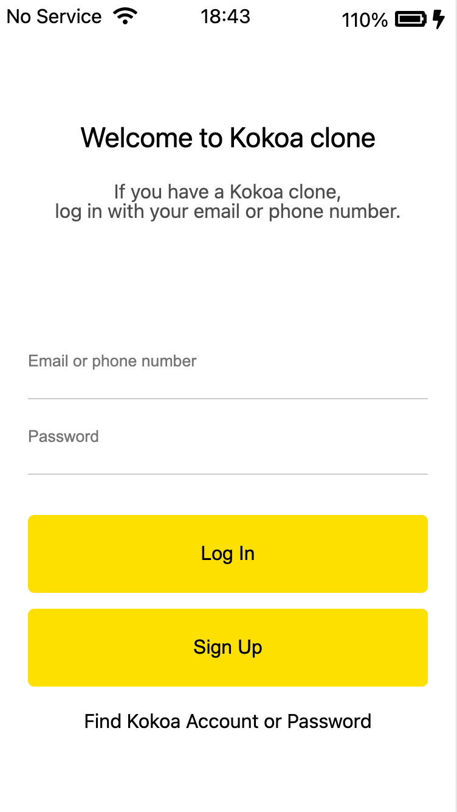

---
layout: post
title: CSS 스타일 우선 순위
---  

## CSS style precedence(CSS 스타일 우선 순위)  

이전까지는 CSS에서 적용 우선순위 혹은 우위를 판별하는 요소가 단순히 뒤에 오는 요소가 그렇다고 생각을 했었다.  

그런데 kokoa talk clone coding을 하던 중 다음 상황을 격게되었다.  

```css
.login-form > input{
    padding: 23px 0px;
    border: none;
} 
.login-form__id-input, .login-form__pswd-input{
    border-bottom: 1px solid rgb(0, 0, 0, 0.2);
    transition: 0.3s ease-in-out;
}
```  

위 css 코드가 실행되는데, login-form__id-input 과 login-form__pswd-input이 border가 제거되고 밑에 border-bottom이 적용되는 것을 예상했다.  

그런데 웬걸 위 `.login-form`이 우선순위를 가져가 id, pswd input cell의 border가 나타나지 않는 것이다.  

그래서 폭풍 구글링 해본 결과 CSS에도 우선순위가 존재한다는 것을 알게되었다.  

1. !important라고 명시된 attributes.
2. tag에 inline(html 상에서)으로 style attribute select.
3. 선택자(selector)가 #id
4. 선택자가 .class, pseudo class(:~)
5. 선택자가 tag  

** 잠깐 recap**  
html에서  
```html
<tag attribute="attribute-value"><tag/>
```  

조금더 자세히 우선 순위를 계산하기 위해서 실제 browser는 각 단계별로 점수를 매겨 비교한 뒤 높은 점수의 css styles를 우위에 둔다. 이 점수를 **특정도**라고 한다  

1. !important라고 명시된 attributes. -> 특정도 비교 없이 우위
2. tag에 inline(html 상에서)으로 style attribute select. 
    -> 특정도 개당 1000점

3. 선택자(selector)가 #id -> 특정도 100점  
4. 선택자가 .class, pseudo class(:~) -> 특정도 10점 
5. 선택자가 tag -> 특정도 1점  

그리고 신기 한 것이 or(,)로 연결되어 표현된 선택자의 경우에는 점수를 더하는 것이 아닌 하나로만 처리하는 것 같다.  

예를 들면 처음 보여준 코드에서 두번째 selector는 `10*2=20`점이 아닌 `10*1=10`점짜리 인 것이다.  

그럼 위 소스코드가 왜 생각대로 적용이 되지 않았는지도 알 수 있다.  

```css
.login-form > input{
    padding: 23px 0px;
    border: none;
} 
.login-form__id-input, .login-form__pswd-input{
    border-bottom: 1px solid rgb(0, 0, 0, 0.2);
    transition: 0.3s ease-in-out;
}
```  
`.login-form > input`은 10+1=11점이고,  

`.login-form__id-input, .login-form__pswd-input`은 10*1=10점으로 뒤에 있는데도 불구하고 특정도가 낮아 `border-bottom: 1px solid rgb(0, 0, 0, 0.2);`가 아닌 `border: none` 이 적용된 것이다.  

우선순위를 알고나니 시원하게 이해가 됬다. 원래 원하는데로 하려면 두번째의 특정도를 높이거나 첫번째를 줄여야하는데, 나는 딱히 방법이 떠오르지 않아 일단은 brute force하게 해결하였다.  

```css
.login-form__id-input, .login-form__pswd-input, .login-form__login-btn, .login-form__sign-up-btn{
    padding: 23px 0px;
    border: none;
}
.login-form__id-input, .login-form__pswd-input{
    border-bottom: 1px solid rgb(0, 0, 0, 0.2);
    transition: 0.3s ease-in-out;
}
```  

<p align="center"><p/>  

편안~  

참고: 
1. CSS 스타일 우선 순위  
https://engkimbs.tistory.com/913  
2. CSS 다중 선택 요소  
https://blog.naver.com/PostView.nhn?blogId=shinekjm&logNo=221618781015  
