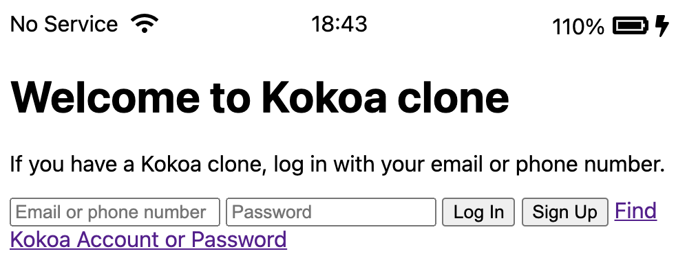
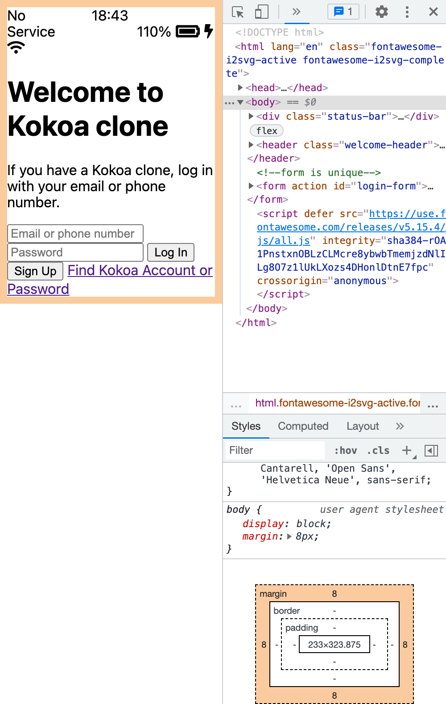

---
layout: post
title: 
---  

## 브라우저의 default margin, padding등을 초기화 시키기.  

html을 읽고 brouse 해주는 browser는 chrome, safari, edge 등등이 있다.  

지난 포스팅(중간에 element 위치하게 하기)에서 봤듯이 소스를 짜고 다음 step으로 넘어가기전, browser가 기본적으로 넣은 margin, padding등을 없에보도록 하겠다.  

  

  

위처럼 설정하지 않은 8 margin이 body에 임의로 들어가 있는 것을 알 수 있다.  

이런 값들을 초기화해주는 css를 개발자들이 작성을 해놓았고, 이를 찾아서 import하기만 하면 된다.  

google에 reset.css라고 치면 해당 소스들이 나오는데, 가장 최신 버전(포스팅 시점에선 2.0)을 선택해주자.  

이 소스를 reset.css로 저장하고 styles.css 기준 상대 경로를 작성하여 import 해준다.  

```css
@import "reset.css";
```  

