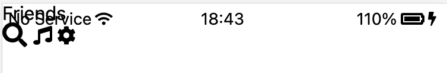

---
layout: post
title: Mutiple fixed position block 관리. 
---  

## 문제 상황  

kokoa clone에서 `friends.html`에 title을 표현하는 header의 html 구조를 짜고 `friends.html`을 봤는데, 다음과 같이 보였다.  

  

이는 이전에 `status-bar.css`에서 status bar를 `position: fixed;`로 설정을 하여 scroll을 해도 계속 위치를 유지하도록 fix한 것 때문에 새 title header의 위치를 무시하고 status bar가 위로 덮어 버린 것이다.  

그러나 title header도 fixed되어야 하기 때문에, fixed로 만든 후 자세히 조정하기로 하자.  

```css
.screen-header{
    position: fixed;
}
```  
그러나 이렇게 하니 둘다 고정된 상태로 겹쳐저 보인다. 아무래도 두 block사이의 관계를 정리해주어야 하는 것 같다.  


