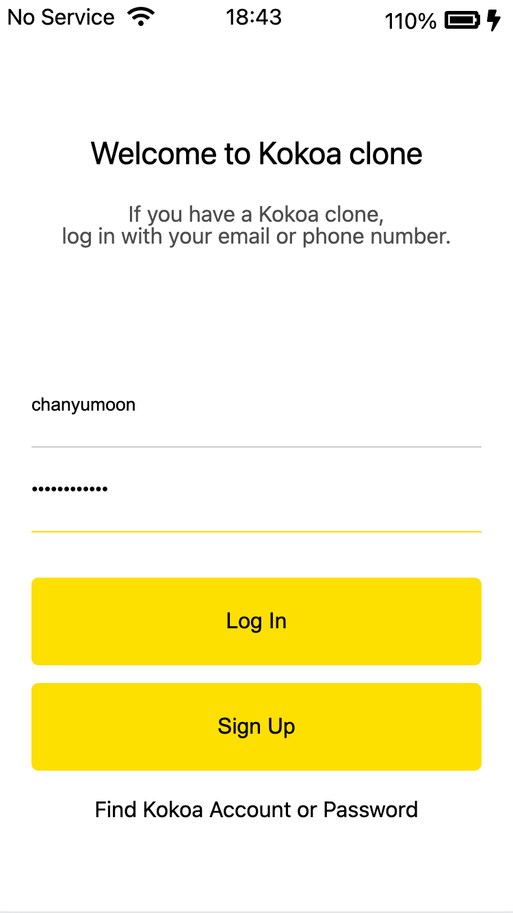

---
layout: post
title: action and method of form, How web size the block.
---  

## 정보를 전달하는 방법.  

html에서 .html 간에 정보를 전송하는 방법에는 form에 속하는 action과 method attributes을 사용하는 방법이 있다.  

```html
    ...
    <form action="friends.html" method="get" class="login-form">
        <input name="username" class="login-form__id-input" type="text" placeholder="Email or phone number">
        <input name="password" class="login-form__pswd-input" required type="password" placeholder="Password">
        <input class="login-form__login-btn" type="submit" value="Log In">
        <input class="login-form__sign-up-btn" type="submit" value="Sign Up">
        <a class="login-form__find-id-pswd-a" href="#">Find Kokoa Account or Password</a>
    </form>
    ...
```  

form 의 `action="friends.html"`은 이 form 내부의 정보들을 받아 `freinds.html`로 보낸다는 것이고, `method="get"`은 이 정보를 보내는 방식인데, `get`말고도 `post`방식있다. `get`은 정보를 url에 담아 보내는 방식으로 간단하나 보안이 약하다는 단점이 있는 반면, `post`방식은 서버를 통해 정보를 다음 html로 보내는 방식으로 보안이 강하여 대부분은 이 방식을 사용한다.  

다만 공개되어도 상관없는 정보들의 경우에는 가볍고 단순한 `get`방식을 사용하기에 `get`역시 중요한 method라고 볼 수 있다.  

`get`방식으로 다음 html로 넘어갔을때 입력한 정보가 어떻게 표시되는지는 아래 그림을 통해서 알 수 있다.  

  
  

Url에서 보이듯이 가장 뒤에 `input`의 name과 입력값이 key-value 형식으로 뒤에 적혀있는 것을 알 수있다.  

## Border Box box 크기 설정 원리  

kokoa 강의 따라 듣던 중 nicolas가 point out한 box의 size가 어떻게 조절되는지에 대해서 다뤄보겠다.  

예를 들어 200px의 box를 만들었다고 생각을 해보자. 그리고 우리가 이 친구에게 `padding-left:100px`을 주었다고 생각을 해보자. Browser는 이를 어떻게 처리를 할까?  

`padding-left`는 왼쪽 border 부터 안쪽까지 100px을 주는 것이다. 이때 box의 크기 역시 유지가 되어야 하므로 총 300px 크기의 box가 생기는 것이다. 이 크기가 설정된 화면의 width보다 크게되면, box가 밖으로 나와 잘려 보이게 된다.  

이렇게 box를 처리하는 default 방식은 다음과 같이 code로 나타내어져 있다.  

```css
box-sizing: content-box;
```  

이를 막기 위해서 `box-sizing: border-box;`를 작성해주면, box의 크기를 padding까지 포함하여 생각하게 된다. 즉, browser는 padding을 포함한 크기를 box의 크기로 생각하여 50+150px의 box를 만드는 것이다. 즉 width가 200px로 유지가 된다.  

참고: 
https://developer.mozilla.org/ko/docs/Web/CSS/box-sizing  
